# DeskWare Next

A modular, fully parameterized fork of DeskWare (design by Hands on Katie,
OpenSCAD by BlackjackDuck). Same design language, new architecture: every
part is generated from parameters, so storage systems of **any dimensions**
can be produced — no more fixed 196 mm plates. With default settings, parts
remain print-interchangeable with original DeskWare.

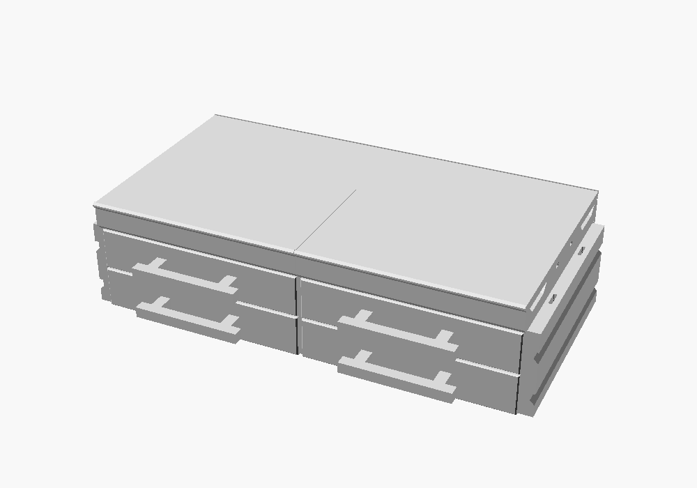

## Requirements

- OpenSCAD (recent version; developed against 2026.06)
- [BOSL2](https://github.com/BelfrySCAD/BOSL2) on the OpenSCAD library path
- The experimental `roof` feature enabled (GUI: Preferences → Features →
  roof; CLI: `--enable=roof`) — the end caps use it, and OpenSCAD silently
  renders them incomplete without it

## Quick start

```scad
include <deskware-next.scad>

//a whole system in one call...
storage_system(sections = 2, width = 196, depth = 196.5, total_height = 107.5);

//...or any single part at any size
base_plate(width = 250);
drawer(height_units = 2, rows = 2, columns = 3);

//too big for your printer? cut it, with mating connectors at the seams
split_part(size = [420, 211, 9.5], gap = 20)
    top_plate(width = 420, anchor=BOT);
```

Or open **`examples/customizer.scad`** in OpenSCAD and use the Customizer
panel: pick a part, set the dimensions, export.

Defaults live in [`config.scad`](config.scad) — including your print bed
size (`MAX_PRINT_WIDTH`/`MAX_PRINT_DEPTH`); parts warn when they exceed it.
The full API is documented in [`docs/reference.md`](docs/reference.md).

### Single-file build

Platforms like MakerWorld's parametric maker lab accept only one `.scad`
file. `tools/flatten.py` inlines all project includes (keeping the BOSL2
ones, which such platforms provide) into a self-contained, geometrically
identical build, hiding the framework internals from the Customizer panel:

```bash
python3 tools/flatten.py examples/customizer.scad -o build/deskware-next-makerworld.scad
```

## Examples

| | |
| --- | --- |
|  **[multi_section_desk](examples/multi_section_desk.scad)** — the classic two-section desk system, one `storage_system()` call | 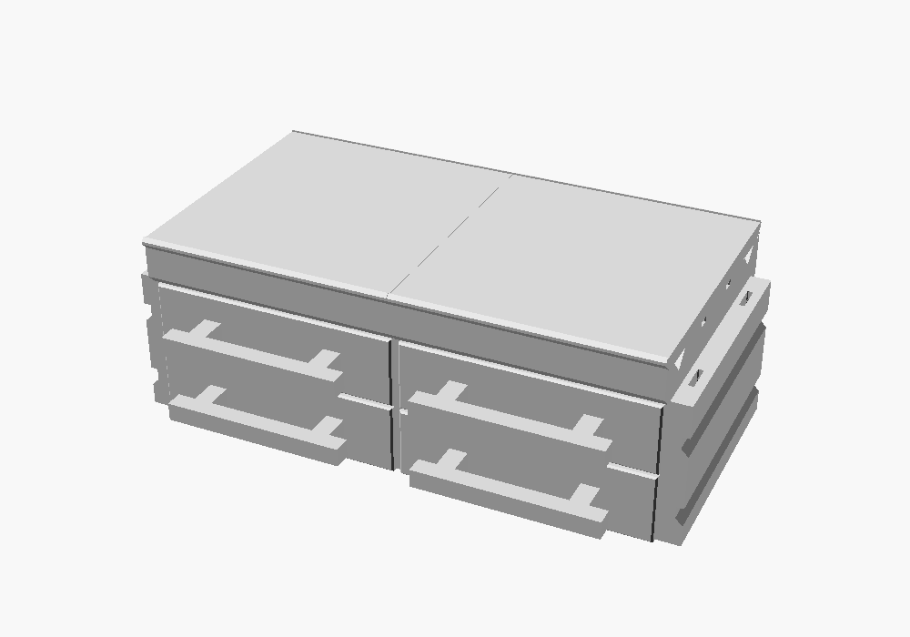 **[compact_system](examples/compact_system.scad)** — the same modules at 140 mm: every part prints whole on a small bed |
| 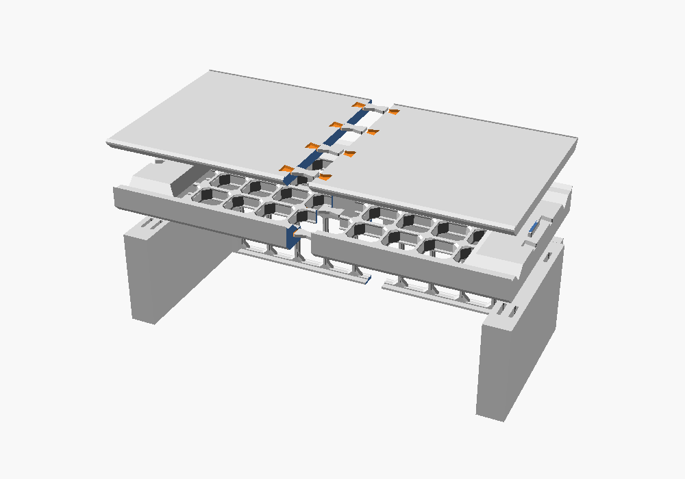 **[monitor_shelf](examples/monitor_shelf.scad)** — a 300 mm shelf, plates and backer auto-split with dovetail keys | 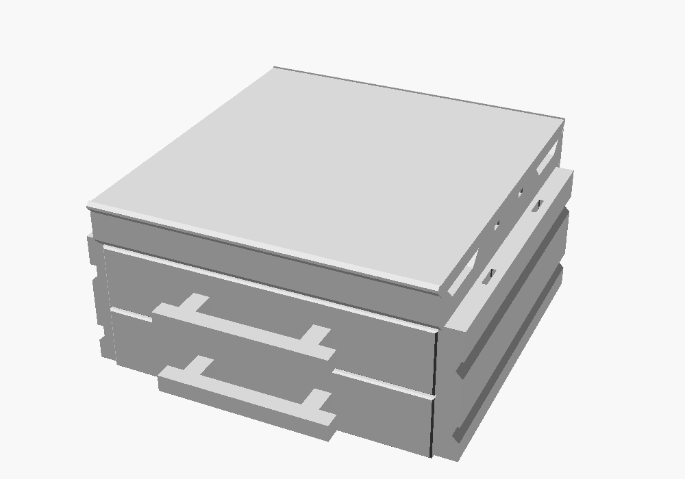 **[customizer](examples/customizer.scad)** — interactive part generator via the OpenSCAD Customizer |
| 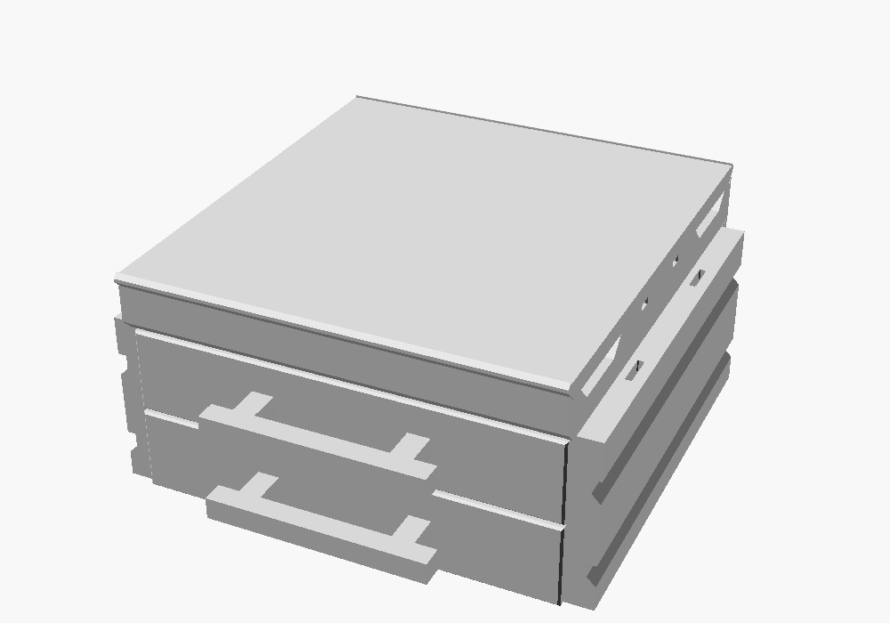 **[core_section_demo](examples/core_section_demo.scad)** — one full core section, placements derived from config | 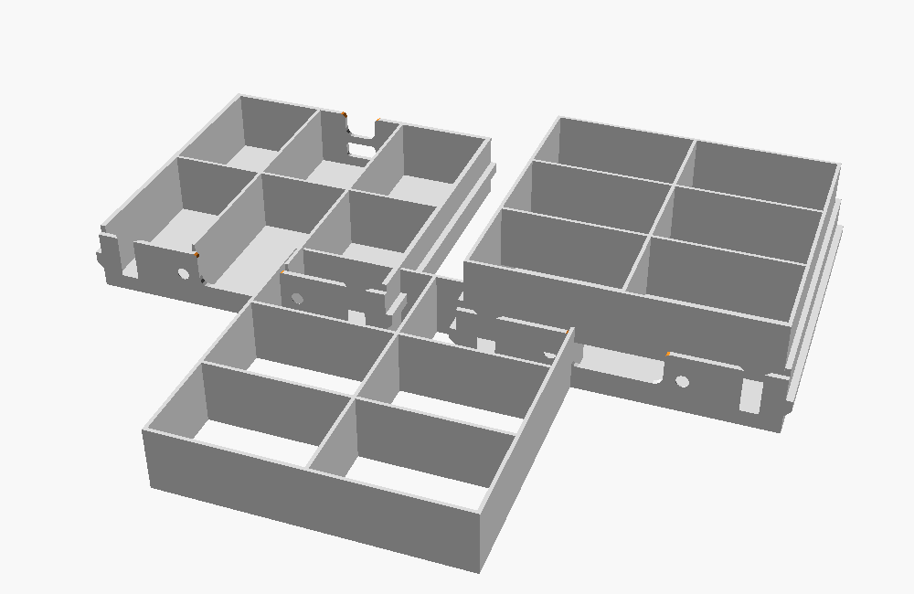 **[divided_drawer_demo](examples/divided_drawer_demo.scad)** — built-in `rows × columns` compartments and the drop-in `divider_insert()` |
| 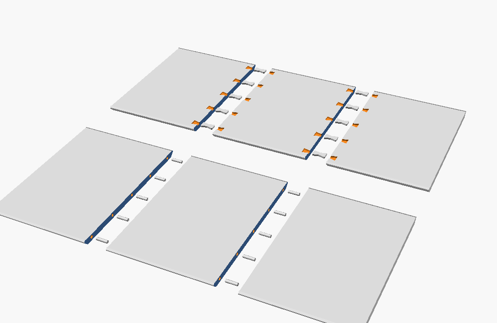 **[split_demo](examples/split_demo.scad)** — a 420 mm top plate split two ways (dovetails / hidden dowels) | 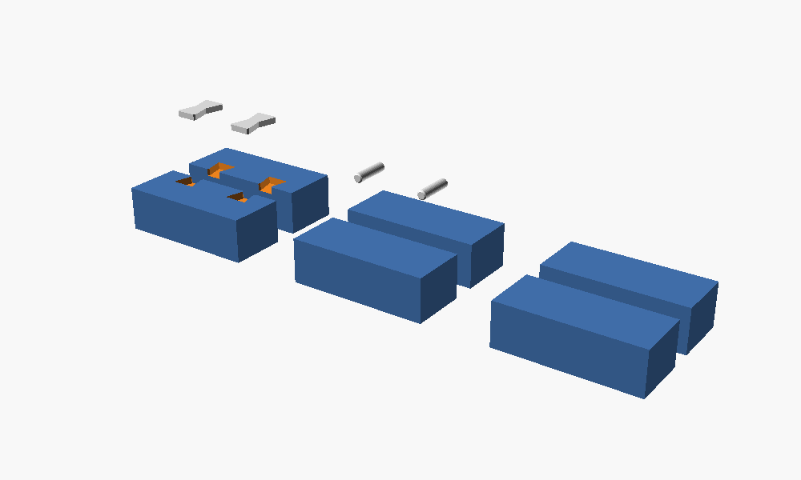 **[connector_fit_test](examples/connector_fit_test.scad)** — printable fit coupons for every seam connector style |
| 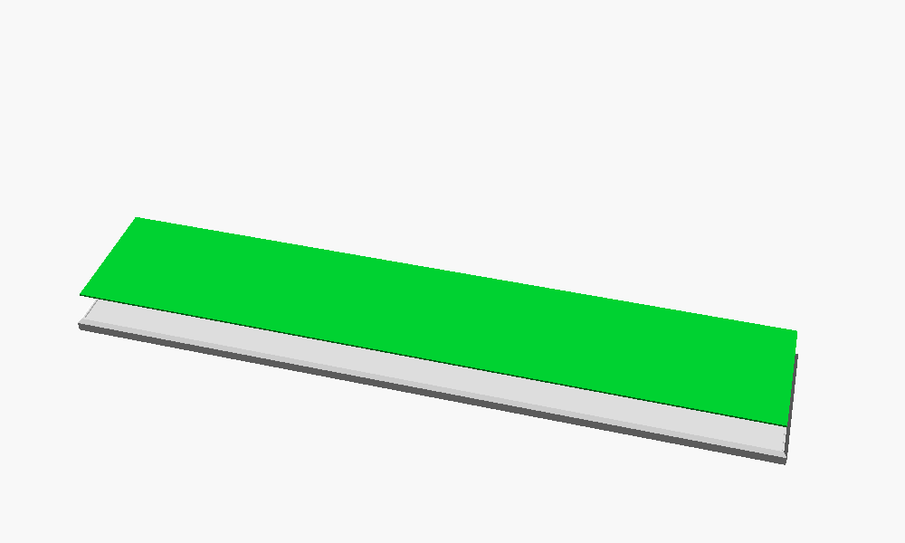 **[inlay_drawer_front](examples/inlay_drawer_front.scad)** — recessed drawer front with a printable contrast inlay | 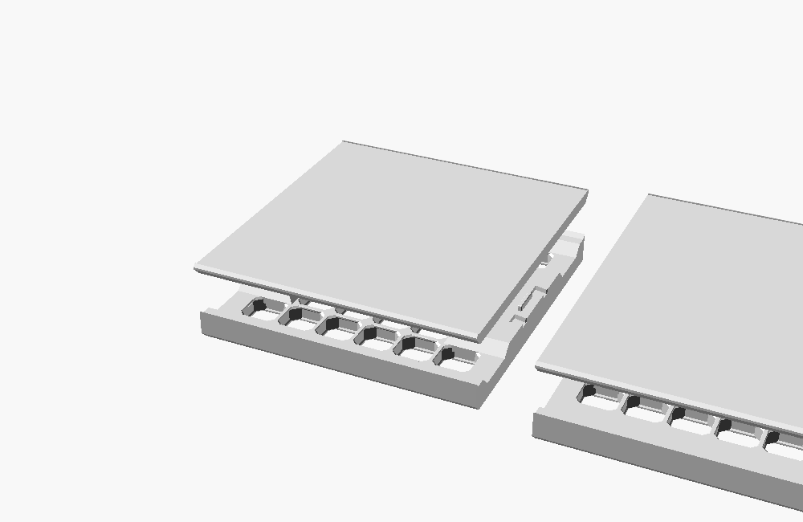 **[plates_demo](examples/plates_demo.scad)** — base + top plates at default and arbitrary dimensions |
| 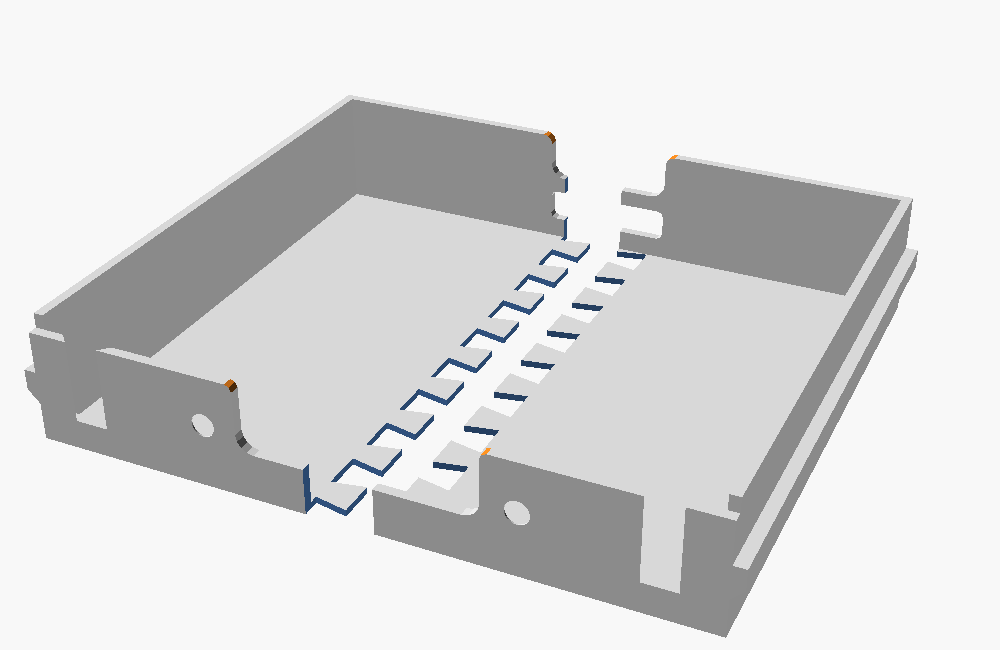 **[test_print_200](examples/test_print_200.scad)** — a complete 200 mm test system pre-split for a 175 mm bed: 2×2 grid splits with hidden dowels, puzzle glue seams for thin walls | |

## Structure

| Path | Contents |
| --- | --- |
| `config.scad` | User-facing parameters (dimensions, clearances, print bed, connectors, colors) |
| `core/` | Fixed system constants, pure derivation functions, print-fit checks, split system |
| `geometry/` | 2D cross-section profiles and sweep helpers |
| `connectors/` | HOK connectors, dovetails, dowels, magnets, tabs, slides, screws, seam joint API |
| `modules/` | The parts: plates, end caps, drawers + fronts, handle, riser, backer, dividers, `storage_system()` |
| `vendor/` | openGrid tiles (by David D), ported verbatim |
| `tools/` | Build helpers: `flatten.py` single-file build for MakerWorld-style platforms |
| `examples/` | Ready-to-render demos (see gallery above) |
| `docs/` | [Reference](docs/reference.md) and gallery images |
| `legacy/` | The original monolithic sources, unmodified — the regression oracle |

## Milestone status

- [x] **M1** — project structure, configuration system, shared utilities
- [x] **M2** — dynamic base/top plate generators
- [x] **M3** — dynamic drawer generator (plus riser and backer, completing the core section)
- [x] **M4** — dynamic divider system (`drawer(rows, columns)` + drop-in `divider_insert()`)
- [x] **M5** — connector system (`CONNECTOR_STYLE`-dispatched seam joints: dovetail, dowel, magnet)
- [x] **M6** — accessories: skipped by design — the plates carry standard openGrid fields, so the existing openGrid accessory ecosystem drops straight in
- [x] **M7** — automatic split generation for oversized parts (`split_part()` with seam connectors)
- [x] **M8** — documentation and examples

## Fidelity to the original

Every ported part was verified against the original sources (preserved in
[`legacy/`](legacy/)): STL exports at default dimensions match with zero
volume and bounding-box deltas, so DeskWare Next parts mate with original
DeskWare prints. See the provenance section of the
[reference](docs/reference.md).

## AI disclosure

The DeskWare Next refactor was written with substantial help from
[Claude Code](https://claude.com/claude-code), Anthropic's coding agent —
under human direction, with every part verified against the original
sources and validated in test prints.

## License

CC BY-NC-SA 4.0, inherited from the original DeskWare. See
[LICENSE.md](LICENSE.md) for attribution.
